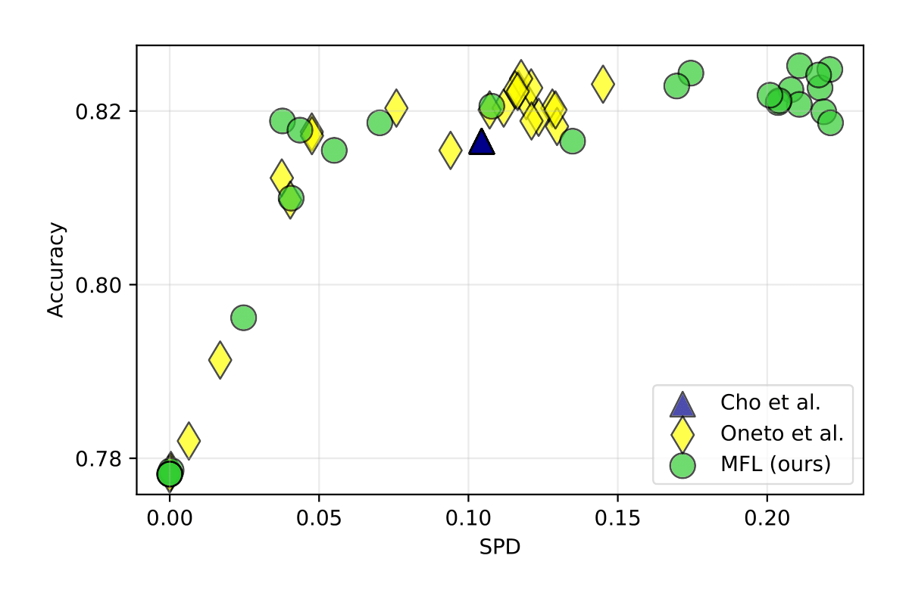
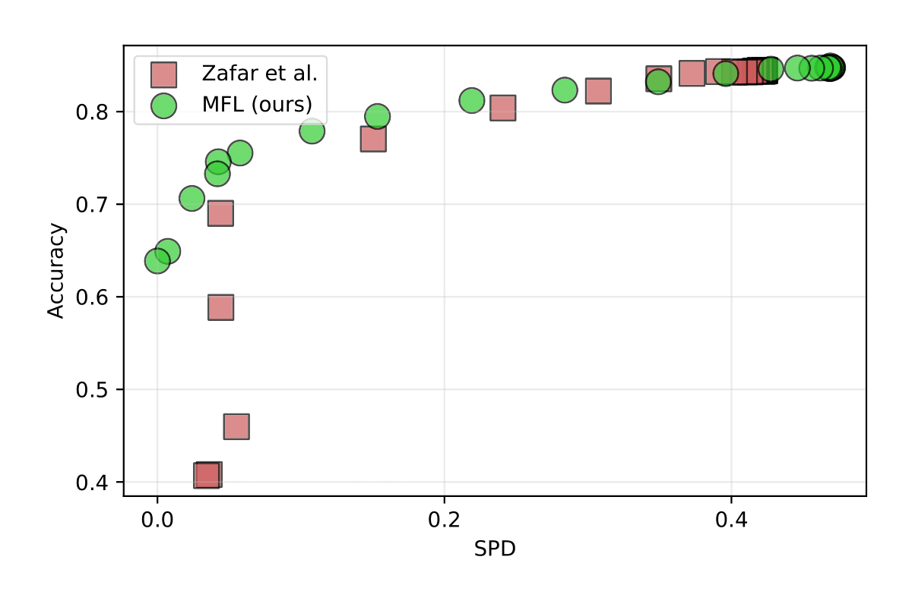

# results

This folder contains additional results. Currently, we provide the preliminary results for a comparison using the same models as suggested by reviewer `tqef`. We compare Logistic Regression and 2 layer Neural Networks with 20 hidden nodes and ReLU activation for hidden nodes.

## Pareto Front
We provide results for the Drugs and Communities and Crime datasets. The pareto frontier plots can be found in the following files:

| File                                        | Dataset               | Model               | Number of Replications |
|---------------------------------------------|-----------------------|---------------------|------------------------|
| CommunitiesCrimeClassification_logistic.png | Communities and Crime | Logistic Regression | 2                      |
| CommunitiesCrimeClassification_NN.png       | Communities and Crime | Neural Network      | 2                      |
| Drug_logistic.png                           | Drug                  | Logistic Regression | 3                      |
| Drug_NN.png                                 | Drug                  | Neural Network      | 3                      |

## Results on Drug Dataset (10 Seeds):
The following tables summarize the AUC values (± standard deviation) for logistic regression and neural network based models.

### Logistic Regression Model:

| Method       | AUC          | Time      |
|--------------|--------------|-----------|
| Zafar et al. | 0.668±0.041  | 0.35sec |
| MFL          | 0.817±0.015 | 7.62sec |

### Neural Network Model:

| Method       | AUC          | Time      |
|--------------|--------------|-----------|
| Cho et al.   | 0.731±0.017  | 10.68sec  |
| Oneto et al. | 0.826±0.010 | 531.99sec |
| MFL          | 0.825±0.010 | 8.85sec   |

## Results on Communities and Crime Dataset (10 Seeds):

### Logistic Regression Model:

| Method       | AUC          | Time      |
|--------------|--------------|-----------|
| Zafar et al. | 0.787±0.014 | 81.05sec |
| MFL          | 0.827±0.013 | 8.80sec  |

### Neural Network Model:

| Method       | AUC          | Time      |
|--------------|--------------|-----------|
| Cho et al.   | 0.451±0.029 | 13.91sec  |
| Oneto et al. | 0.830±0.012 | 337.24sec |
| MFL          | 0.834±0.012 | 11.97sec  |

